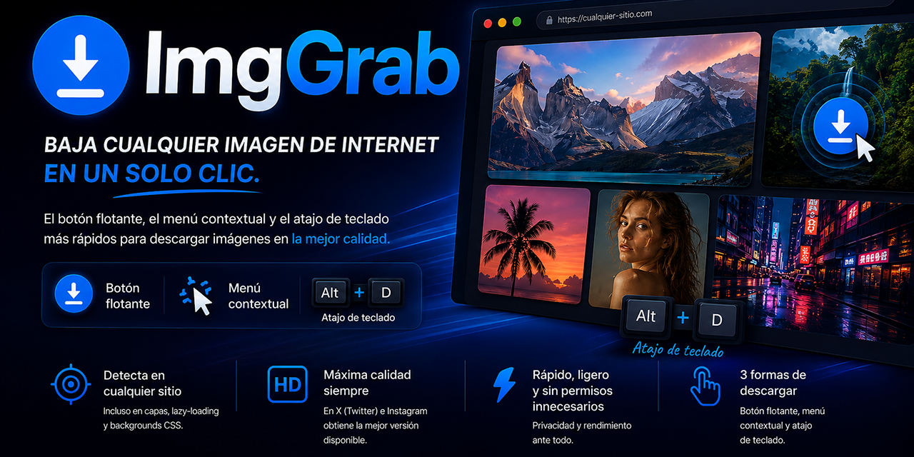

# ImgGrab 🖼️⬇️


<!-- 📌 Placeholder: reemplaza esta imagen por tu cabecera definitiva en assets/imggrab-header.png (ancho recomendado ~1200px) -->

**La forma más rápida de bajar cualquier imagen de internet, sin abrir pestañas ni buscar el botón de "guardar" escondido.**

ImgGrab es una extensión de Chrome ligera y sin permisos innecesarios que coloca un botón flotante sobre cualquier imagen al pasar el cursor, además de un menú contextual y un atajo de teclado. Detecta imágenes incluso en sitios que las esconden detrás de capas, lazy-loading o backgrounds CSS — y en X (Twitter) e Instagram, siempre descarga la versión de mayor calidad disponible.

---

## 🙋 ¿Qué hace esto, en criollo?

Si no eres desarrollador: imagina que estás viendo fotos en Instagram, X, Pinterest o cualquier página, y quieres guardar una. Normalmente tendrías que hacer clic derecho → "Guardar imagen como…", y muchas veces ese menú ni siquiera te da la imagen en su mejor calidad (te da una miniatura pixelada).

Con ImgGrab, simplemente pasas el mouse sobre la imagen, aparece un botoncito azul (⬇️) encima, y con un clic se descarga directo a tu carpeta de descargas — ya en la mejor calidad posible. También puedes seguir usando clic derecho, o el atajo `Alt+D` para bajar la imagen del post que tengas centrado en pantalla (ideal en Instagram/X mientras haces scroll).

---

## 🧠 Decisiones clave de diseño (para desarrolladores)

[#-decisiones-clave-de-diseño-para-desarrolladores](#-decisiones-clave-de-diseño-para-desarrolladores)

ImgGrab no es un simple listener de `click` sobre ``. Varios sitios modernos (Instagram, X) apilan capas transparentes de interacción (doble-tap, carruseles, overlays de UI) **por encima** de la imagen real, que no son ancestros del `` en el DOM sino elementos hermanos superpuestos. Esto rompe cualquier detección basada en `event.target` o `composedPath()`.

- **`elementsFromPoint()` en vez de `composedPath()`:** en cada `mousemove` se hace una consulta espacial por píxel de todo lo que hay apilado bajo el cursor, no solo la cadena de ancestros del evento. Así se "atraviesan" esas capas transparentes y se llega a la imagen real, incluso dentro de Shadow DOM abierto (que Chrome ya aplana para hit-testing).
- **Botón con `pointer-events: none`:** el botón flotante nunca intercepta al propio mouse. Esto evita parpadeos (el botón nunca puede "taparse a sí mismo" en la detección) pero como efecto secundario, **el botón no puede recibir `:hover` nativo de CSS** — el hover visual se resuelve a mano comparando la posición del cursor contra el rectángulo del botón en cada `mousemove`.
- **Cascada de candidatos:** `` real → `<image>` de SVG → elemento con `background-image` de tamaño razonable (≥30×30px, para descartar íconos/decoración).
- **Fallback anti-lazy-loading:** si la URL detectada es un placeholder (base64 diminuto, 1×1), se revisan atributos comunes de lazy-load (`data-src`, `data-lazy-src`, `data-original`, etc.).
- **Upgrade de calidad en X/Twitter:** reescribe la URL de `twimg.com` para forzar `:orig`/`name=orig`, evitando la miniatura comprimida.
- **Guardas anti-fricción:** un pequeño delay de "armado" (150ms) evita descargas por clics accidentales apenas aparece el botón, y un cooldown (500ms) evita doble descarga por doble clic.

---

## ✨ Características principales

[#-características-principales](#-características-principales)

- 🖱️ **Botón flotante inteligente** que aparece sobre cualquier imagen, con efecto hover y color adaptado al sitio (rosa en Instagram, negro en X, azul en el resto).
- 🖼️ **Detección profunda:** ``, `<svg><image>`, y backgrounds CSS — no solo imágenes "normales".
- ⚡ **Máxima calidad automática** en X/Twitter e Instagram (evita miniaturas).
- ⌨️ **Atajo de teclado `Alt+D`** para descargar la imagen del post que tengas centrado en pantalla, sin mover el mouse.
- 🖱️ **Menú contextual** (clic derecho) con opciones para imagen, enlace a imagen, o la imagen de la pestaña actual.
- 🙈 **Modo "no molestar"**: `Shift`/`Ctrl`/`Cmd` + clic (o clic derecho) sobre el botón lo oculta para esa imagen específica, sin descargar.
- 🔒 **Permisos mínimos:** solo `downloads` y `contextMenus`. Sin analytics, sin llamadas a servidores externos, sin rastreo.

---

## 🌐 Alcance: ¿dónde funciona?

[#-alcance-dónde-funciona](#-alcance-dónde-funciona)

ImgGrab se inyecta en **todas las páginas** (`<all_urls>`), con soporte especial afinado para:

- **Instagram** — incluye selección de la mejor resolución vía `srcset` y color de marca en el botón.
- **X / Twitter** — upgrade automático de calidad (`:orig`) y detección del post central con `Alt+D`.
- **Casi cualquier otra web** — blogs, tiendas, foros, sitios con diseños antiguos, páginas con `background-image` en vez de ``, y sitios que usan Shadow DOM.

No está garantizado en páginas con protecciones anti-scraping agresivas (canvas renderizado, DRM de imágenes) ni en contenido dentro de iframes de terceros con políticas CORS estrictas — pero para el 95% de la navegación diaria, funciona sin configuración adicional.

---

## 📚 Instalación

[#-instalación](#-instalación)

ImgGrab aún no está en la Chrome Web Store, así que se instala como extensión "descomprimida" (modo desarrollador) — toma menos de un minuto:

1. Descarga o clona este repositorio.
2. Abre Chrome (o Edge/Brave/Opera) y ve a `chrome://extensions`.
3. Activa **"Modo desarrollador"** (interruptor arriba a la derecha).
4. Haz clic en **"Cargar descomprimida"**.
5. Selecciona la carpeta raíz del proyecto (la que contiene `manifest.json`).
6. Listo — el ícono de ImgGrab aparecerá en tu barra de extensiones.

> 💡 Si actualizas el código después, solo vuelve a `chrome://extensions` y haz clic en el ícono de recarga (🔄) sobre la tarjeta de la extensión.

---

## 🖱️ Cómo usarlo

[#-cómo-usarlo](#-cómo-usarlo)

| Acción | Cómo hacerlo |
|---|---|
| Descargar una imagen | Pasa el cursor sobre ella y haz clic en el botón ⬇️ que aparece |
| Descargar vía menú | Clic derecho sobre la imagen → "Descargar esta imagen" |
| Descargar un enlace a imagen | Clic derecho sobre el enlace → "Descargar imagen enlazada" |
| Descargar el post centrado (X/Instagram) | `Alt + D` |
| Ocultar el botón para una imagen puntual | `Shift`/`Ctrl`/`Cmd` + clic (o clic derecho) sobre el botón |

> 🙈 **¿El botón te estorba sobre algún control de la página?** Haz clic derecho sobre él y desaparecerá momentáneamente para esa imagen. Si mueves el cursor fuera y vuelves a entrar, reaparecerá — puedes ocultarlo de nuevo cuantas veces haga falta. Es un comportamiento intencional: evita que el botón quede superpuesto de forma permanente sobre botones, enlaces u otros controles del sitio, sin necesidad de una lista de exclusiones.

---

## 📁 Estructura del proyecto

[#-estructura-del-proyecto](#-estructura-del-proyecto)

Así debería verse el repositorio en GitHub para que todo — íconos, capturas y licencia — se muestre correctamente:

```
ImgGrab/
├── assets/
│   ├── imggrab-header.png     # Imagen de cabecera del README
│   └── demo.gif               # GIF mostrando el botón en acción
├── icons/
│   ├── icon16.png
│   ├── icon32.png
│   ├── icon48.png
│   └── icon128.png
├── background.js
├── content.js
├── manifest.json
├── LICENSE
└── README.md
```

Notas sobre la estructura:
- **`assets/`** es solo para material del README (capturas, GIFs, banner) — Chrome nunca lo lee, así que puedes meter ahí lo que quieras sin afectar la extensión.
- **`icons/`** sí lo lee Chrome (referenciado desde `manifest.json`) — no lo renombres sin actualizar las rutas ahí.
- No hace falta `.gitignore` para este proyecto: no hay `node_modules`, artefactos de build ni pasos de compilación — es JavaScript plano que Chrome carga directamente.
- Si más adelante agregas un ícono de popup o una página de opciones, ese HTML/CSS puede vivir en la raíz o en una carpeta `popup/`, referenciado desde `manifest.json`.

---

## 📄 Licencia

[#-licencia](#-licencia)

Este proyecto está bajo la licencia **MIT** — puedes usarlo, modificarlo y distribuirlo libremente, incluso en proyectos comerciales, siempre manteniendo el aviso de copyright. Ver [LICENSE](LICENSE) para el texto completo.

---

## 💖 Apoyo

[#-apoyo](#-apoyo)

ImgGrab es gratuito y de código abierto. Si te ahorra tiempo en tu día a día, considera invitarme un café:

El botón abre el enlace en la pestaña actual\
Clic derecho → Abrir enlace en nueva pestaña

[](https://frkl81.gumroad.com/l/ImgGrab "Clic derecho → Abrir enlace en nueva pestaña")

---

*Construido para ahorrarte clics, uno a la vez.*
